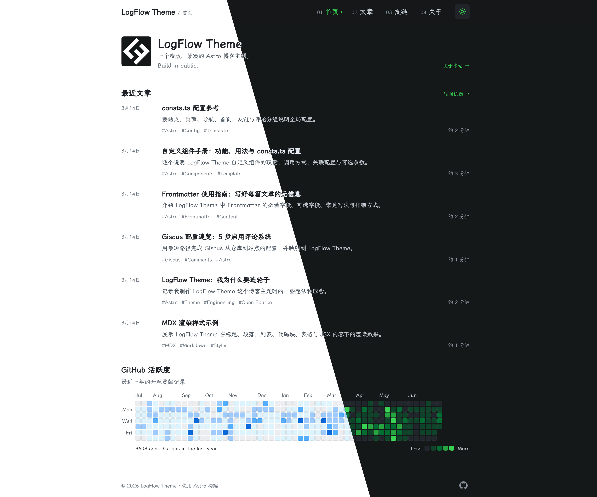

# LogFlow Theme

一个简洁、内容优先的 Astro 博客主题，适合中文写作、个人主页和技术文档。

> A compact, content-first Astro theme for blogs and personal sites.



## 功能

- Markdown/MDX、代码高亮、一键复制和可选文章头图
- 专题、标签、年份归档、友链和 About 页面
- 明暗主题、响应式移动端导航和键盘焦点样式
- RSS、sitemap、canonical、Open Graph 和 Twitter Card
- 可选 Giscus 评论与 GitHub 活跃度组件
- GitHub Pages 自动构建部署


## 快速开始

```bash
git clone https://github.com/kevynf/logflow-theme.git
cd logflow-theme
npm install
npm run dev
```

开发地址默认为 `http://localhost:4321`。要求 Node.js `>=22.12.0`。

```bash
npx astro check
npm run build
npm run preview
```

## 首次配置

大多数站点信息集中在 `src/consts.ts`：

| 配置 | 用途 | 必填 |
| --- | --- | --- |
| `SITE_TITLE` | 站点标题、Header、RSS | 是 |
| `SITE_DESCRIPTION` | 默认 SEO 描述 | 是 |
| `SITE_URL` | 生产站点地址 | 部署时是 |
| `COPYRIGHT_NAME` | 页脚版权名称 | 否 |
| `PAGE_COPY` | 各页面标题和描述 | 否 |
| `NAV_LINKS` | 桌面端和移动端导航 | 否 |
| `SOCIAL_LINKS` | 页脚社交链接 | 否 |
| `HOME` | 首页头像、简介、格言和文章数量 | 否 |
| `GH_CONTRIBUTE` | GitHub 活跃度区块 | 否 |
| `COMMENTS` | Giscus 评论系统 | 否 |

友链位于 `src/config/friend-links.ts`，按 `FriendLink` 接口添加即可；未填写 `avatar` 时自动使用 favicon。

颜色、字体、间距、宽度和圆角等设计令牌位于 `src/styles/global.css` 顶部的 CSS 变量中。

## 写作

文章放在 `src/content/blog/`，支持 `.md` 和 `.mdx`。最小 Frontmatter：

```yaml
---
title: 我的第一篇文章
description: 一句话摘要
pubDate: 2026-07-16
---
```

完整字段：

```yaml
---
title: Frontmatter 使用实践
description: 文章摘要
pubDate: 2026-07-16
updatedDate: 2026-07-17
collection: Astro
collectionDescription: Astro 主题开发记录
tags:
  - Astro
  - Theme
heroImage: ./cover.png
---
```

`title`、`description` 和 `pubDate` 必填，其余字段可选。无 `heroImage` 时不会出现破损图片或空的社交图片元信息。

## Giscus

在 GitHub 仓库启用 Discussions 后，修改 `src/consts.ts` 中的 `COMMENTS` 并填写 `repoId`、`categoryId`。评论默认关闭；字段不完整时页面会显示配置提示。

## 图片与头像

- 头像：省略 `avatar` 即使用 `public/favicon.svg`。
- 文章图片：可放在文章目录并通过 `heroImage` 引用，但不是必需项。
- favicon：替换 `public/favicon.svg` 即可更新默认头像和站点图标。

## GitHub Pages

将仓库 Pages Source 设置为 **GitHub Actions**，推送到 `main` 后自动部署。工作流会设置 `SITE_URL=https://<owner>.github.io` 与 `BASE_PATH=/<repository-name>`。

## 自定义边界

- 站点文案与行为：`src/consts.ts`
- 友链：`src/config/friend-links.ts`
- 文章与 About：`src/content/`
- 颜色、字体、间距和布局密度：`src/styles/global.css`
- 页面结构：`src/pages/`、`src/layouts/`、`src/components/`

优先通过配置和内容完成定制，只有需要改变结构时才修改组件或布局。

## License

MIT
