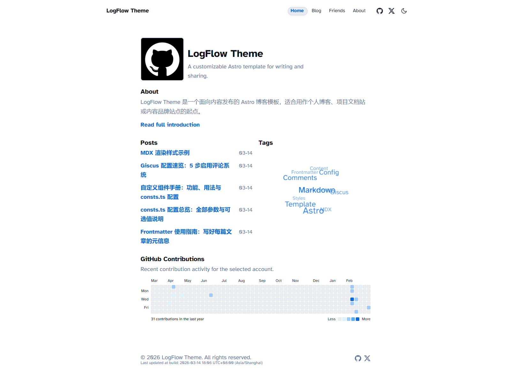
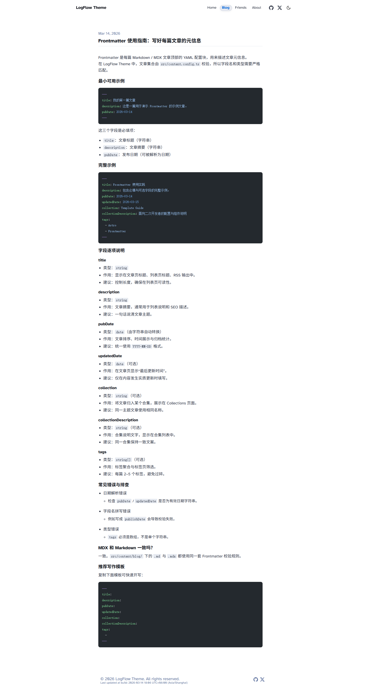
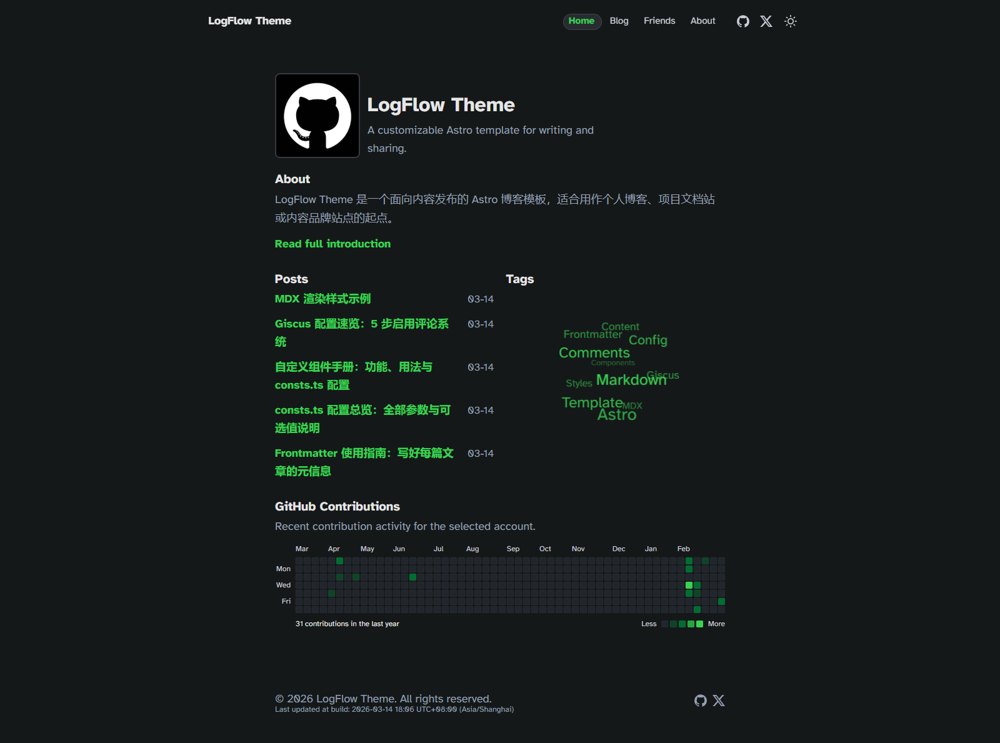
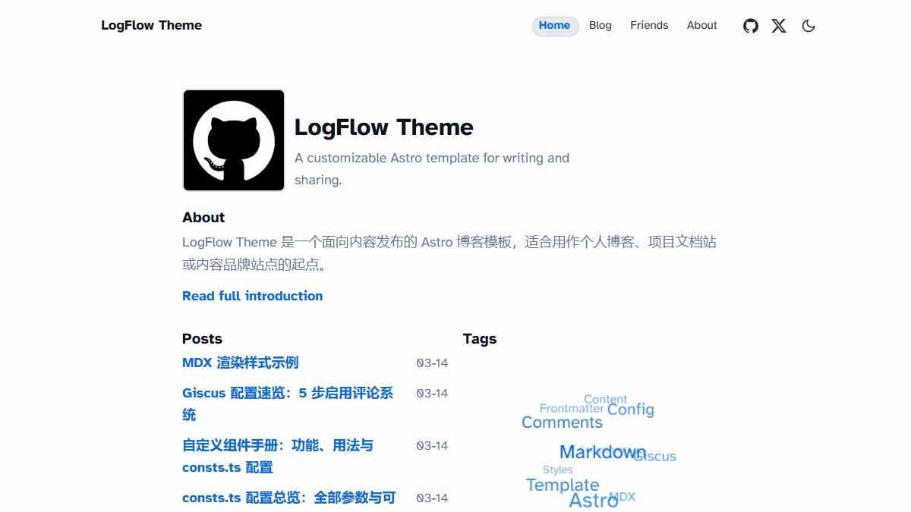

# LogFlow Theme

一个面向内容发布的 Astro 博客模板，内置：

- 文章列表、标签页、合集页、按年份归档页
- About、Friends 页面与社交链接
- 暗色模式切换
- Giscus 评论组件（可开关）
- Markdown + MDX 内容支持

## 亮点

- 开箱即用的内容结构：文章、标签、合集、年份归档完整闭环
- 配置集中在 `src/consts.ts`：站点信息、首页卡片、评论与社交一处维护
- 文档示例齐全：组件说明、Giscus、Frontmatter、MDX 样式均有可直接参考文章
- 评论系统可渐进启用：默认关闭，填入参数后即可启用 Giscus
- 主题体验完整：亮暗模式切换 + GitHub 贡献图展示

## 截图预览

### 首页



### 文章页



### 暗色模式



### Header 滚动动效



## 快速开始

### 1) 克隆仓库

```bash
git clone https://github.com/kevynf/logflow-theme.git
cd logflow-theme
```

### 2) 安装依赖

```bash
npm install
```

### 3) 本地开发

```bash
npm run dev
```

默认访问地址：`http://localhost:4321`

## 发布前最小配置

优先修改 `src/consts.ts`：

- `SITE_TITLE`：站点标题
- `SITE_DESCRIPTION`：站点描述（SEO 与首页文案）
- `COPYRIGHT_NAME`：页脚版权名称
- `SOCIAL_LINKS`：顶部/底部社交链接
- `HOME_PROFILE`：首页头像、昵称、标语等
- `GH_CONTRIBUTE`：GitHub 贡献图用户名与文案
- `COMMENTS`：Giscus 评论配置

建议同时修改：

- `astro.config.mjs` 中的 `site` 为你的正式域名
- `src/content/about/index.md` 为你的 About 页面内容

## 内容编写

### 文章目录

- 所有文章放在 `src/content/blog/`
- 支持 `.md` 和 `.mdx`

### Frontmatter 字段

```yaml
---
title: 文章标题
description: 文章摘要
pubDate: 2026-03-14
updatedDate: 2026-03-15
collection: Template Guide
collectionDescription: 面向二次开发者的配置与组件说明
tags:
  - Astro
  - Template
---
```

其中：

- `title`、`description`、`pubDate` 为必填
- `updatedDate`、`collection`、`collectionDescription`、`tags` 为可选

## Giscus 评论接入

1. 将仓库设为公开并开启 Discussions
2. 在 giscus.app 生成配置参数
3. 填入 `src/consts.ts` 的 `COMMENTS`
4. 保持文章页布局启用 `enableComments={true}`

仓库内已包含一篇独立示例文章：`giscus-configuration-quickstart.md`，可直接参考。

## 示例内容

仓库已提供模板示例文章，可用于二次发布前的内容替换：

- `custom-components-handbook.md`：自定义组件与 `consts.ts` 配置说明
- `consts-configuration-reference.md`：`consts.ts` 全量参数说明
- `frontmatter-usage-guide.md`：Frontmatter 字段与写作模板
- `giscus-configuration-quickstart.md`：Giscus 配置速览
- `mdx-rendering-showcase.mdx`：Markdown/MDX 渲染样式演示

## 常用命令

| 命令 | 说明 |
| :--- | :--- |
| `npm run dev` | 启动本地开发服务器 |
| `npm run build` | 构建静态产物到 `dist/` |
| `npm run preview` | 本地预览构建结果 |
| `npm run astro -- check` | 进行 Astro 项目检查 |

## 部署建议

可直接部署到 Vercel、Netlify、Cloudflare Pages 或 GitHub Pages（静态导出）。

推荐流程：

1. 本地执行 `npm run astro -- check`
2. 本地执行 `npm run build`
3. 推送到 GitHub 并连接部署平台

## License

MIT
